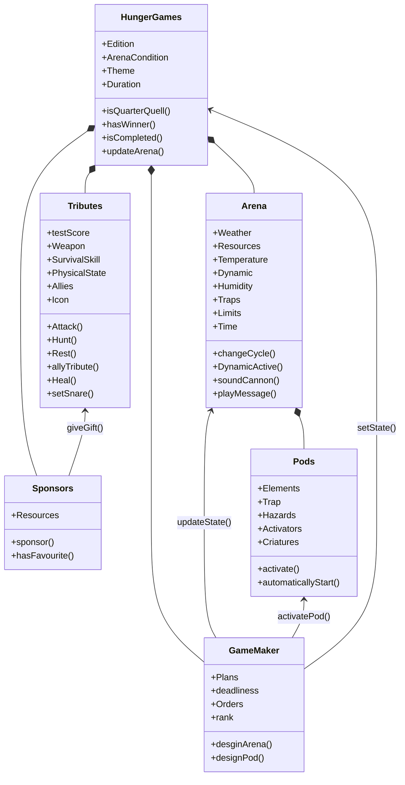
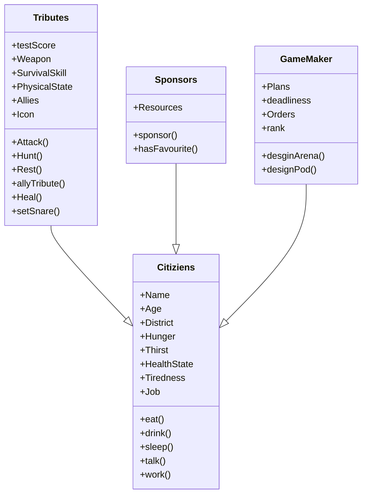

# POO_Reto_02

### Soy Malcom Yamil Carrillo Quintero y pertenezco al grupo de "Fenomenoides", adelante se muestra nuestro logo

Preparense para ver el grandioso logo: 

<figure>  
<figcaption><b> "somos programadores, no diseñadores" </b></figcaption></figure>

 

## Diagrama de clases.
### Caso: Hunger Games

Como una saga de libros y peliculas que me gustan decidí realizar el diagrama de clases realizando la abstracción del evento de los juegos del hambre en sí y sus elementos clave junto con sus posibles atributos y metodos. 

Como estos elementos pertenecen a los juegos este diagrama contiene composición en su mayoría

En esta otra parte se evidencia la herencia de los "objetos" de los juegos que son ciudadanos

